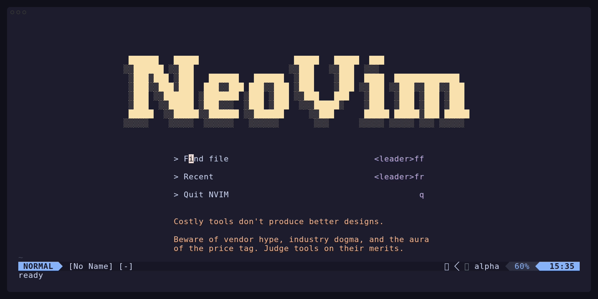

# tutorial.nvim

> Interactive walkthroughs for Neovim plugins

[](https://github.com/AlejandroGomezFrieiro/tutorial.nvim/actions/workflows/ci.yml)
[](LICENSE)




`tutorial.nvim` is a small tutorial/walkthrough engine that allows users
to take a hands-on approach to familiarizing themselves with a new plugin. Similar
in spirit to [vim_tutor_mode](https://neovim.io/doc/user/pi_tutor/) and
[vimtutor](https://vimschool.netlify.app/introduction/vimtutor/) but
with a more generic approach to it that also includes executing commands, different interactivity etc. Props to the original tutoring!

This plugin came as a sort of necessity while developing
[storyteller.nvim](https://github.com/AlejandroGomezFrieiro/storyteller.nvim)
as I realized that a User Guide was always going to be insufficient for
actually teaching newcomers how to use it.

## Features

- **Steps check off as you actually do things** — run a command, press a key,
  save a file, fix a diagnostic, or satisfy any Lua predicate. A step can
  never trap you: manual completion always works.
- **Never steals focus** — tours pin in a split beside your work and update
  silently; your windows, cursor, and mode stay put.
- **Sticky progress** — quit anytime, resume later; only an explicit reset
  un-checks a step.
- **Asks questions** — steps can prompt for input on the command line and
  speak your answers back through later copy and checks.
- **Teaches in the moment** — hint ladders reveal one nudge at a time,
  recall steps hide their keys until you have tried, and author-declared
  mistakes get gentle corrections instead of dead ends.
- **Tutorials are data** — register Lua tables with full power, or share
  declarative-only `.tutorial.json` files; definitions are linted the moment
  they load.

## Requirements

- Neovim 0.9+.

## Installation

Install with your favorite plugin manager:

```lua
{
  "AlejandroGomezFrieiro/tutorial.nvim",
  cmd = "Tutorial",
}
```

## Quick start

Open Neovim and run:

```
:Tutorial
```

Pick **Hello, tutorial.nvim** from the menu — it completes each of its own
steps by a different mechanism, so one short tour shows you everything the
engine can watch. Progress sticks until you reset it, so you can leave and
come back.

## Usage

```
:Tutorial                        choose a tour from the menu
:Tutorial <id>                   start/resume one directly
:Tutorial focus|next|prev        steer the active tour
:Tutorial goto N|status
:Tutorial new <id>               scaffold a starter tutorial file
:Tutorial load <path>            register from .lua or .tutorial.json
:Tutorial stats [id]             see where learners stall (opt-in analytics)
:Tutorial reset [id]             forget progress (one, or all)
```

While a tutorial runs it stays pinned in a split beside your work; steps
check off without ever moving your cursor. Keys and configuration are
covered in [docs/running.md](docs/running.md).

## Creating a tutorial

Run `:Tutorial authoring` for the basics, which will teach you how to write a
tutorial called `my-first`. Or start from this — a complete, registrable
definition:

```lua
require("tutorial").register({
  id = "greet-basics",
  title = "Greeting basics",
  summary = "Say hello with your plugin",
  tags = { "getting-started" },
  steps = {
    {
      id = "read-docs",
      title = "Read the docs",
      body = { "Skim the README, then press {key:d}." },
      hint = { "Just d.", "Rung two if you are curious." },
    },
    {
      id = "run-greeting",
      title = "Run the greeting",
      body = { "Execute :Greet and watch this step check itself off." },
      completion = { "on_command:Greet" },
    },
  },
})
```

Every field above is optional except `id`, `title`, and `steps`. Steps can
also ask questions, branch on answers, mask their keys until attempted, and
correct anticipated mistakes — the full schema lives in
[docs/authoring.md](docs/authoring.md).

To share a tour as plain data instead of Lua, write the same shape as JSON
(no functions — string completion specs only) into a `.tutorial.json` file
and load it with `:Tutorial load <path>`.

For more information, see [docs](docs/) or `:h tutorial` inside Neovim.

## Development

The whole gate is Nix: `nix flake check` runs the test suite and the Lua
style check exactly as CI does. The fast path for tests alone:

```bash
nvim --headless -u NONE -l tests/tutorial_spec.lua
```

Bugs and ideas are welcome in the [issue tracker](https://github.com/AlejandroGomezFrieiro/tutorial.nvim/issues).

## AI disclaimer

`tutorial.nvim` was developed with the aid of AI tools.

## License

MIT — see [LICENSE](LICENSE).
